# Tugas 1 IF3110 Pengembangan Aplikasi Berbasis Web

## Anggota

**Tony - 13516010**

**Harry Setiawan Hamjaya - 135161079**

**Jessin Donyson - 13516112**

## Tampilan dan Deskripsi Web

### Login

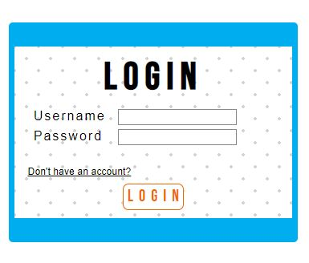

Halaman ini digunakan user untuk dapat masuk ke akun pengguna dengan memasukkan username dan password lalu menekan tombol **LOGIN**.

Pengguna hanya dapat login dengan akun yang sudah didaftarkan. Jika pengguna belum memiliki akun, pengguna dapat menekan link **Dont't have an account?** untuk menuju halaman Register.

Setelah login, pegguna akan dibawa ke halaman Search.

### Register

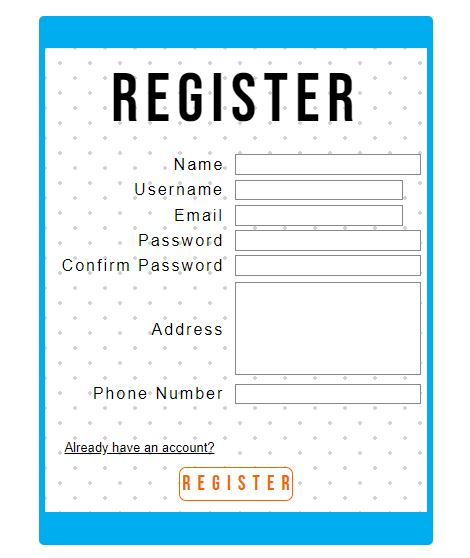

Halaman ini digunakan user untuk mendaftarkan akun pengguna.
Dengan mengisi semua field yang ada sampai valid dan menekan tombol **REGISTER**.

Jika pengguna sudah memiliki akun, maka pengguna dapat menekan link **Already have an account?** untuk menuju halaman login.

Setelah registrasi pengguna akan otomatis login dan menuju halaman Search.

### Header Web

Halaman ini digunakan user untuk melakukan navigasi terhapap web.
- **Browse**: Tombol yang digunakan untuk memasuki halaman search.
- **History**: Tombol yang digunakan untuk memasuki halaman history.
- **Profile**: Tombol yang digunakan untuk memasuki halaman profile.
- **logout**: Tombol yang dilambangkan dengan gambar turn-off untuk mengakhiri akses dengan akun user.

### Search Page

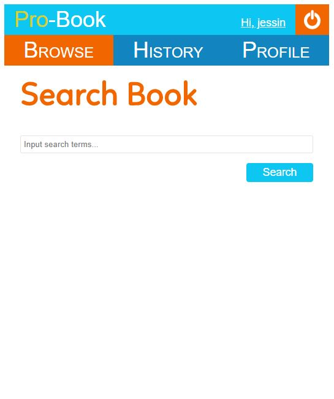

Halaman ini digunakan untuk melakukan pencarian buku.
Dengan inputnya sebagai  sebagian atau seluruh nama dari buku yang ingin dicari lalu menekan tombol **Search** untuk memulai pencarian. Pengguna akan dibawa ke halaman Search Result.

### Search Result Page

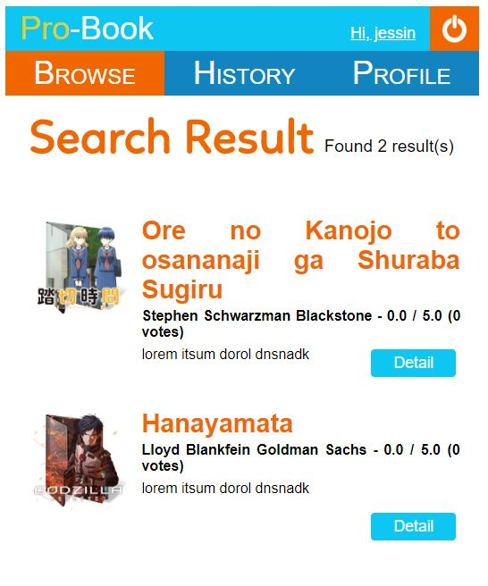
Halaman ini menampilkan hasil pencarian dari halaman Search.
Hasil pencarian berupa list dari buku-buku, yang mengandung:
* Judul buku.
* Nama penulis buku.
* Rating rata-rata dari buku tersebut.
* Banyak orang yang me-rating buku tersebut.
* Deskripsi singkat buku tersebut.
* tombol **Detail** yang dapat tekan untuk melihat detail dari buku dan menuju halaman Book Detail.

### Book Detail page

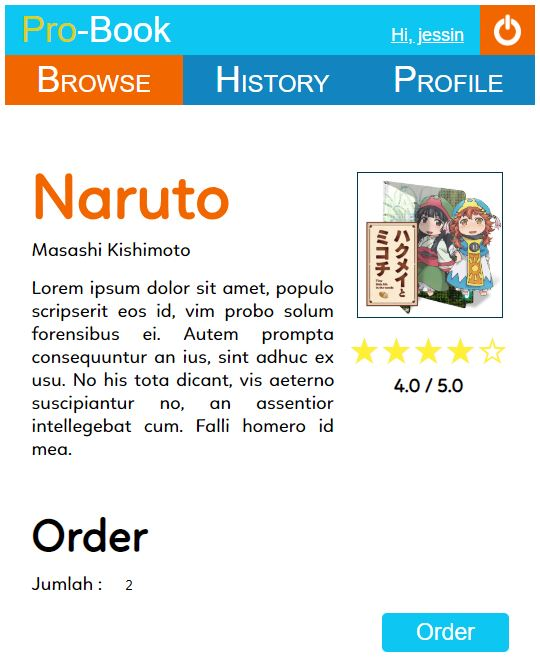
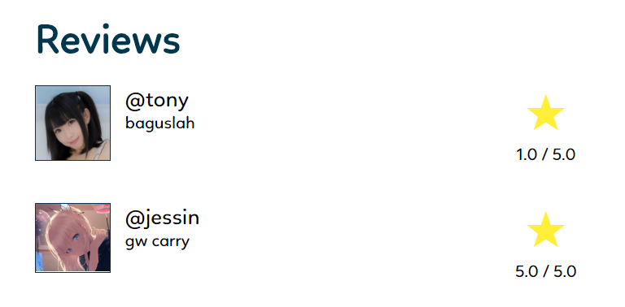
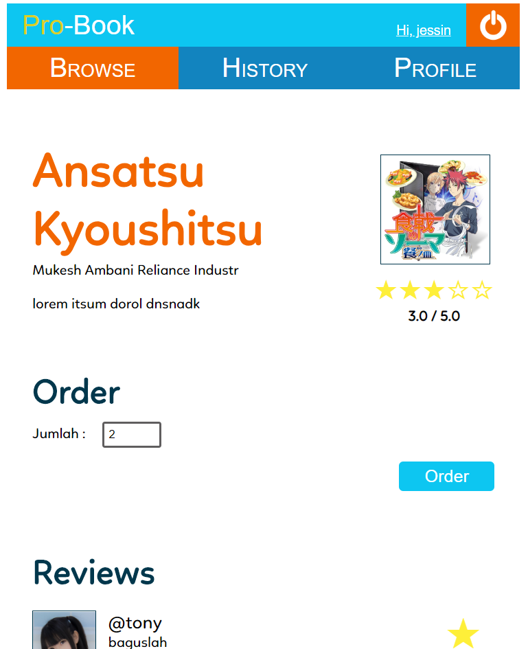

Halaman ini berisi:
* Detail tentang buku berupa: gambar cover buku, judul buku, penulis buku, dan sinopsis.
* Rata-rata rating yang diberikan oleh orang yang sudah membeli.
* Review orang-orang yang tiap review berupa nama orang, rating yang diberikan untuk buku ini dan komentar mereka terhadap buku ini.
* Cara untuk memesan/membeli buku, yaitu dengan memilih banyak buku yang akan dibeli pada *dropdown* disebelah kanan tulisan **Jumlah**, lalu menekan tombol **Order**.

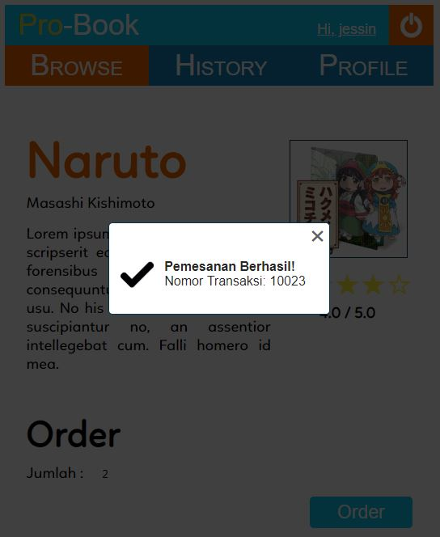

Tampilan diatas didapatkan setelah berhasil memesan buku.

### History page

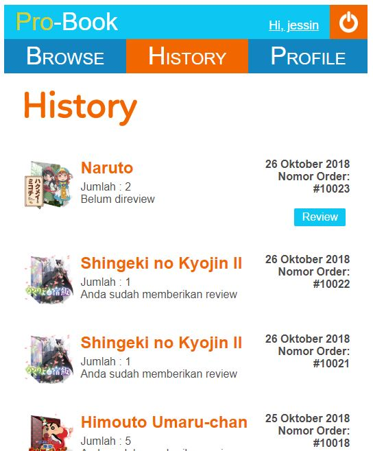

Halaman ini menampilkan riwayat pembelian buku pengguna yang terurut dari yang terkini hingga terlama dengan detail : Nama buku, Tanggal pemesanan/pembelian, Nomor pembelian/order, jumlah yang dipesan, serta keterangan bahwa pemesanan tersebut sudah pernah di beri review atau belum.

Terdapat tombol **Review** yang dapat ditekan pada pemesanan buku yang belum direview. Ketika tombol tersebut ditekan pengguna akan dibawa ke halaman review. 

### Review page

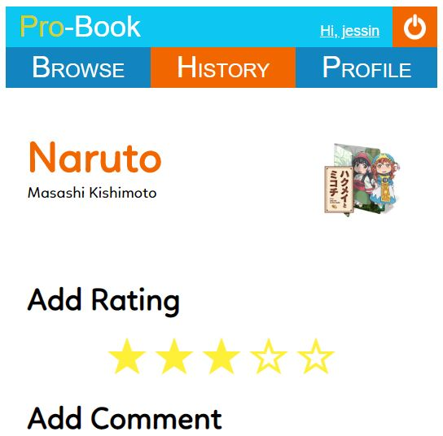
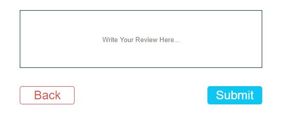

Halaman ini berisi:
* Detail buku berupa judul buku, nama penulis, dan gambar buku.
* Tempat memberikan rating berupa 5 bintang yang dapat dipilih yang bernilai 1 sampai 5 dari kiri ke kanan.
* Kolom tempat pengguna untuk menuliskan komentarnya pada buku yang dipesan.
* Tombol **Back** yang dapat ditekan untuk kembali pada halaman sebelumnya tanpa mengirimkan review pengguna.
* Tombol **Submit** yang dapat digunakan untuk mengirimkan review pengguna berupa rating dan komentar dan setelah itu user dibawa kembali ke halaman history.

### Profile page

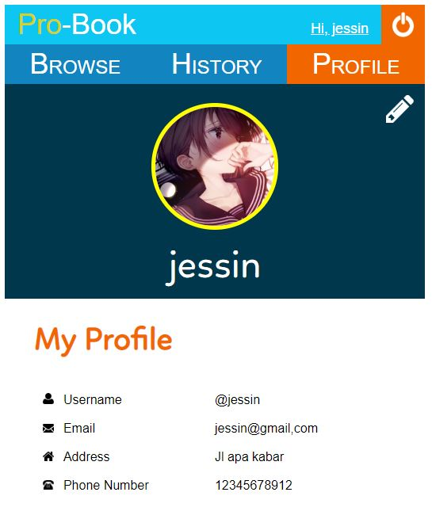

Halaman ini menampilkan detail pengguna berupa:
* Gambar pengguna
* Nama lengkap pengguna
* username pengguna
* email pengguna
* alamat tempat tinggal pengguna
* nomor telepon pengguna

Terdapat tombol **Edit** berupa ikon bergambar pensil yang terdapat di kanan atas yang dapat digunakan untuk mengubah info detail pengguna.

### Edit Profile page

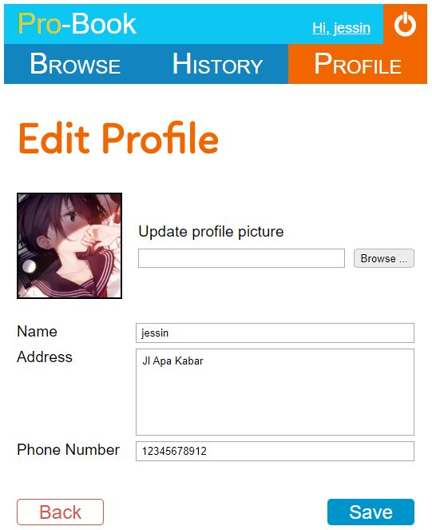

Pada halaman ini pengguna dapat mengubah beberapa info detail-nya, yaitu gambar pengguna, nama pengguna, alamat tempat tinggal pengguna, dan nomor telepon pengguna.

Untuk melakukan pengubahan data pengguna, cukup dengan megubah isi dari tempat pegisian (textbox), data yang tidak ingin diubah, tempat pengisiannya tidak perlu diubah.

untuk foto pengguna cukup dengan menekan tombol **Browse ...** dan memilih foto yang diinginkan.

Terdapat tombol **Back** yang dapat ditekan untuk membatalkan perubahan data. Dan terdapat tombol **Save** yang dapat digunakan untuk menyimpan perubahan data. Kedua tombol tersebut akan membawa pengguna kembali ke halaman Profile.

## Pembagian Kerja

**Tampilan**
1. Login : 13516079, 13516112
2. Register : 13516079, 13516112
3. Search : 13516112
4. Search with result : 13516112
5. History : 13516112
6. Header : 13516112
7. Book detail : 13516112
8. Review : 13516112
9. Profile : 13516010
10. Edit Profile : 13516010, 13516112
11. Error 404 : 13516112
12. Order Modal : 13516112

**Fungsionalitas**
1. Login : 13516079, 13516112
2. Register : 13516079, 13516112
3. Search : 13516112
4. Search with result : 13516112
5. History : 13516079
6. Logout : 13516112
7. Book detail : 13516112
8. Review : 13516010
9. Profile : 13516010
10. Edit Profile : 13516010
11. Order Book : 13516112
12. Auth Validator : 13516079
14. Database : 13516079